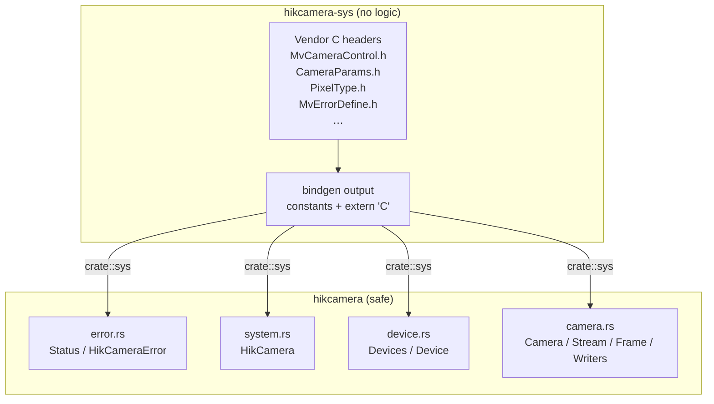
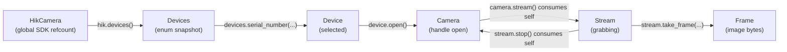

import { Card, CardGrid } from '@astrojs/starlight/components';
import LifecycleStrip from '@components/LifecycleStrip.jsx';

The workspace is split into two crates with very different responsibilities.
Understanding the split — and where the `unsafe` boundary sits — is the
single most useful thing for anyone planning to change the wrapper.

## Two crates

<CardGrid>
  <Card title="hikcamera-sys" icon="seti:c">
    Raw `bindgen` output against the vendor headers. Generates constants,
    type aliases, structs, and `extern "C"` function signatures. The build
    script also links `MvCameraControl.lib` and copies runtime DLLs next to
    the final binary. No logic, no wrappers, no safety.
  </Card>
  <Card title="hikcamera" icon="seti:rust">
    Safe high-level API. Owns the layered lifecycle types (`HikCamera` →
    `Device` → `Camera` → `Stream` → `Frame`), the error model, and all
    image/video writers. Every `unsafe` call into `sys::*` lives here.
  </Card>
</CardGrid>

## The `unsafe` boundary

The wrapper has exactly **one** rule about `unsafe`:

> No `unsafe` is allowed in `crates/hikcamera/src/` outside of FFI calls into
> `crate::sys::*`, and those should already be wrapped by `check(...)` or a
> higher-level helper.

That means every `unsafe { sys::MV_CC_*(...) }` call goes through one of two
choke points:

1. **`error::check(code: i32) -> Result<()>`** — the single function that
   converts an SDK return value into a `Result`. Every status code is checked
   against `MV_OK`; anything else becomes `HikCameraError::Sdk { status }`.
2. **Higher-level helpers in `camera.rs`** — for example the per-FFI-call
   pattern that wraps an uninit buffer plus a `check()` plus a buffer-copy
   plus the matching `Free*` call. These are the only places where the
   invariant gets non-trivial.

Any new `unsafe` block needs a `// SAFETY:` comment explaining the invariant.

## Layered lifecycle

<LifecycleStrip locale="en" />

Each layer is a distinct type that owns one phase of the C SDK lifecycle.
Ownership transfer between layers is the **only** way to progress:

The `consumes self` arrows are deliberate. They make impossible states
impossible to represent:

- You cannot have two active `Stream`s on the same `Camera`.
- You cannot call `take_frame` after `stop()` (the `Stream` is gone).
- You cannot call `MV_CC_Finalize` while a `Camera` is still open — the
  `'hik` lifetime on `Camera<'hik>` forbids it.

## Module map

| Module | Role |
| --- | --- |
| `crates/hikcamera/src/lib.rs` | Crate root, public re-exports |
| `error.rs` | `HikCameraError`, `Status` newtype, SDK code lookup table |
| `system.rs` | `HikCamera` (SDK init/finalize refcount), `HikVersion` |
| `device.rs` | `Device` / `Devices` / `DeviceInfo` / `Transport` |
| `camera.rs` | `Camera`, `Stream`, `Frame`, all node map accessors, image/video writers |

`hikcamera-sys/src/lib.rs` is a thin module that `include!()`s two generated
files from `OUT_DIR` (`status_codes.rs` first, then `bindings.rs`). It has
no logic of its own — see [Bindings generation](/developer/bindings-generation/)
for why the outputs are split.

## Why the split?

1. **`bindgen` rebuilds are slow.** Isolating the FFI in `hikcamera-sys`
   means the `hikcamera` crate can be rechecked without touching the C
   headers (as long as the bindings haven't changed).
2. **Safety story is clear.** `unsafe` is allowed in one crate, forbidden in
   the other. Reviewers know where to focus.
3. **Versioning flexibility.** Bindings can ship under a different semver
   policy than the safe API. (Today they share a workspace version, but the
   boundary exists if it becomes useful.)

## Next steps

- How the bindings are generated (status codes vs `bindgen` output) →
  [Bindings generation](/developer/bindings-generation/).
- How errors are typed → [Error model](/developer/error-model/).
- How to contribute → [Contributing](/developer/contributing/).
