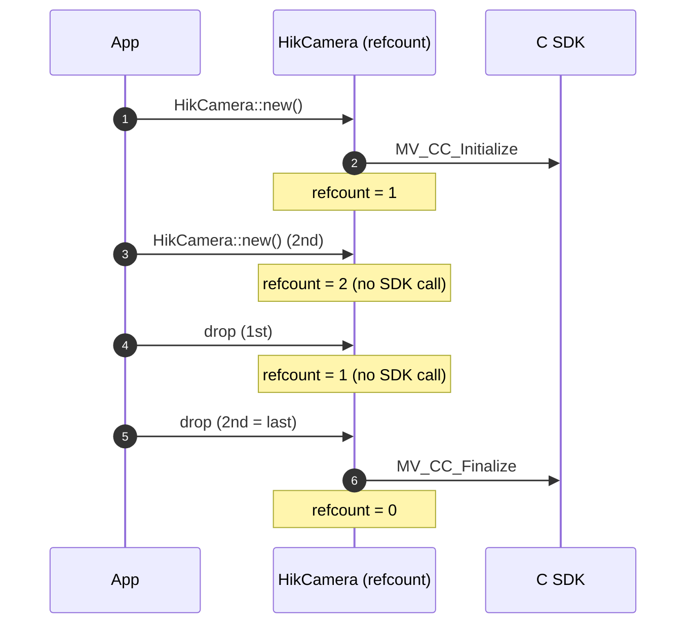

import { Aside, Steps } from '@astrojs/starlight/components';
import LifecycleStrip from '@components/LifecycleStrip.jsx';

`HikCamera` is the outermost type in the wrapper. It owns **global** SDK state:
the C `MV_CC_Initialize` / `MV_CC_Finalize` pair that must bracket every other
SDK call. Every other type in the wrapper borrows the lifetime of a
`HikCamera`.

## Layered types

<LifecycleStrip locale="en" />

Each layer owns a distinct phase of the C SDK lifecycle:

| Type | C SDK calls | Owns |
| --- | --- | --- |
| `HikCamera` | `Initialize` / `Finalize` | Global SDK init refcount |
| `Devices` / `Device` | `EnumDevices` / `IsDeviceAccessible` | Snapshot of visible devices |
| `Camera` | `CreateHandle` / `OpenDevice` / `DestroyHandle` | Device handle, parameter node map |
| `Stream` | `StartGrabbing` / `StopGrabbing` | Grab session, recording state |
| `Frame` | `GetImageBuffer` / `FreeImageBuffer` | Image buffer for one frame |

## `HikCamera`

- **`HikCamera::new()`** — Initialize the SDK.
  - Calls `MV_CC_Initialize` on the first instance.
  - Subsequent instances just bump a shared refcount; they do **not** call
    `Initialize` again.
  - Returns `HikCameraError::Sdk { status }` if the SDK itself refuses to
    initialize.

- **`hik.version()`** — Get the runtime SDK version as a typed `HikVersion`
  (major / minor / patch / build). Backed by `MV_CC_GetSDKVersion`.

- **`hik.devices()`** — Enumerate visible devices. Returns `Devices`, which
  you iterate or filter — see [Device selection](/guide/device-selection/).
  Backed by `MV_CC_EnumDevices`.

- **`Drop`** — Decrements the shared refcount. Only the **last** `HikCamera`
  in the process actually calls `MV_CC_Finalize`.

## Shared refcount

The refcount is process-wide and mutex-protected, so it is safe to construct
`HikCamera` from multiple threads or to keep one in a `OnceLock` /
`LazyLock` for the lifetime of the program.

## `HikVersion`

`HikVersion` is a plain `Copy` struct that decomposes the raw `u32` returned
by `MV_CC_GetSDKVersion`:

| Field | Meaning |
| --- | --- |
| `major` | Major version |
| `minor` | Minor version |
| `patch` | Patch version |
| `build` | Build number |
| `raw` | The original `u32` for diagnostics |

`HikVersion::current()` reads it directly without going through an
`HikCamera` instance — useful for printing the SDK version in `--version`
flags.

## Lifecycle ordering rules

<Steps>

1. `HikCamera` must outlive every `Device` / `Camera` / `Stream` / `Frame`
   derived from it. The wrapper enforces this with Rust lifetimes
   (`'hik`).
2. `Devices` is a snapshot — once it is dropped, the underlying
   `MV_CC_DEVICE_INFO_LIST` memory is freed. Keep it alive while you select.
3. `Camera::stream()` **consumes** the `Camera` by value. Use `stream.stop()`
   to get it back.
4. `Stream::stop()` **consumes** the `Stream`. You cannot restart a stopped
   stream — call `camera.stream()` again for a new one.
5. `Frame` does not borrow the `Stream`, but its buffer must be returned to
   the SDK. Drop the `Frame` after you are done with it (or after copying
   out the bytes you need).

</Steps>

<Aside type="note" title="Why stream() and stop() consume self">
  `MV_CC_StartGrabbing` and `MV_CC_StopGrabbing` are not idempotent on the
  same handle, and the SDK does not track nested grabs. By making
  `stream()` and `stop()` take `self`, the type system makes it impossible
  to leak a grabbing state or double-stop.
</Aside>

## Next steps

- Pick a specific camera → [Device selection](/guide/device-selection/).
- Configure parameters → [Camera configuration](/guide/camera-configuration/).
