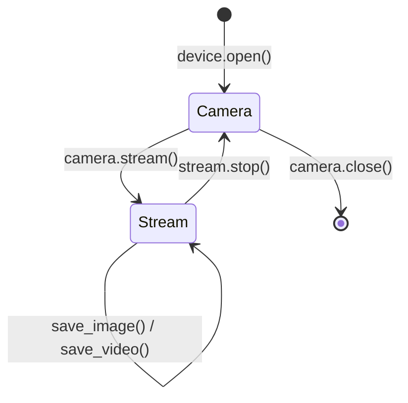

import { Aside, Steps } from '@astrojs/starlight/components';

`Camera::stream()` consumes the `Camera` and calls `MV_CC_StartGrabbing`,
returning a `Stream`. From a `Stream` you pull frames, query buffer depth,
and eventually hand the `Camera` back with `stop()`.

## Lifecycle



The state machine is enforced by **ownership**, not runtime flags:

- `stream()` takes `self` by value — you cannot accidentally grab twice.
- `stop()` takes `self` by value — you cannot accidentally restart.
- `take_frame` only exists on `Stream`, never on `Camera`.

## Pull a frame

```rust
use std::time::Duration;

let mut stream = camera.stream()?;
let frame = stream.take_frame(Duration::from_secs(1))?;
println!("{}x{}, {} bytes", frame.info.width, frame.info.height, frame.data.len());
```

`take_frame(timeout)`:

1. Calls `MV_CC_GetImageBuffer(handle, &mut out, timeout_ms)`.
2. If the SDK returns `MV_E_NODATA`, the wrapper surfaces it as
   `HikCameraError::Sdk { status }` — usually means "timed out".
3. On success, copies the frame bytes into an owned `Vec<u8>` and immediately
   calls `MV_CC_FreeImageBuffer` to release the SDK slot.
4. Returns a `Frame { info: FrameInfo, data: Vec<u8> }` that does **not**
   borrow the `Stream`. You can hold onto it as long as you want.

## Frame info

`FrameInfo` (from `MV_FRAME_OUT_INFO`) carries the metadata of every grabbed
frame:

| Field | Meaning |
| --- | --- |
| `pixel_type` | Pixel format (`MvGvspPixelType` value) |
| `width`, `height` | Image dimensions |
| `frame_len` | Byte length of the data buffer |
| `timestamp`, `frame_id` | Device-side timing |
| `device_id`, `trigger_info` | Source / trigger metadata |
| … | Plus transport-specific fields |

The `data: Vec<u8>` is always `frame_len` bytes long; for abnormal frames
(zero-length) `take_frame` returns an `EmptyFrame` error instead.

## Buffer depth

The SDK maintains an internal frame buffer pool. You can check how many frames
are waiting without pulling them:

```rust
let pending: u32 = stream.get_image_count()?;
```

And you can drain the queue (useful after a long pause or trigger burst):

```rust
stream.clear_buffer()?;
```

## Frame transformations

`Stream` exposes a few in-place transformations that go through the SDK's
own conversion routines (so they understand the source pixel format):

```rust
use hikcamera::{ImageFormat, Rotation};

// Convert to a friendlier pixel format for downstream processing.
let rgb = stream.convert_frame(&frame, ImageFormat::Rgb8.raw())?;

// Rotate / flip — common for cameras mounted upside-down.
let rotated = stream.rotate_frame(&frame, Rotation::Angle180)?;
let flipped = stream.flip_frame(&frame, Flip::Vertical)?;
```

These return a **new** `Frame`; the original is left untouched.

## Stop the stream

```rust
let camera = stream.stop()?;
camera.close()?;
```

`stop()`:

1. If a video recording is active (`MV_CC_StartRecord` was called by a
   `VideoWriter`), it calls `MV_CC_StopRecord` first.
2. Calls `MV_CC_StopGrabbing`.
3. Returns ownership of the underlying `Camera` back to the caller.

<Aside type="note" title="Drop is best-effort">
  `Stream` also implements `Drop` as a safety net: if it goes out of scope
  without `stop()`, `Drop` calls `MV_CC_StopGrabbing` (and `MV_CC_StopRecord`
  if needed) so the device is not left in a grabbing state. But you should
  still call `stop()` explicitly when you can — it gives you the `Camera`
  back and surfaces any SDK errors.
</Aside>

## Next steps

- Save the frame → [Image and video writers](/guide/image-and-video/).
- See all `FrameInfo` fields → TODO link to frame-info reference.
