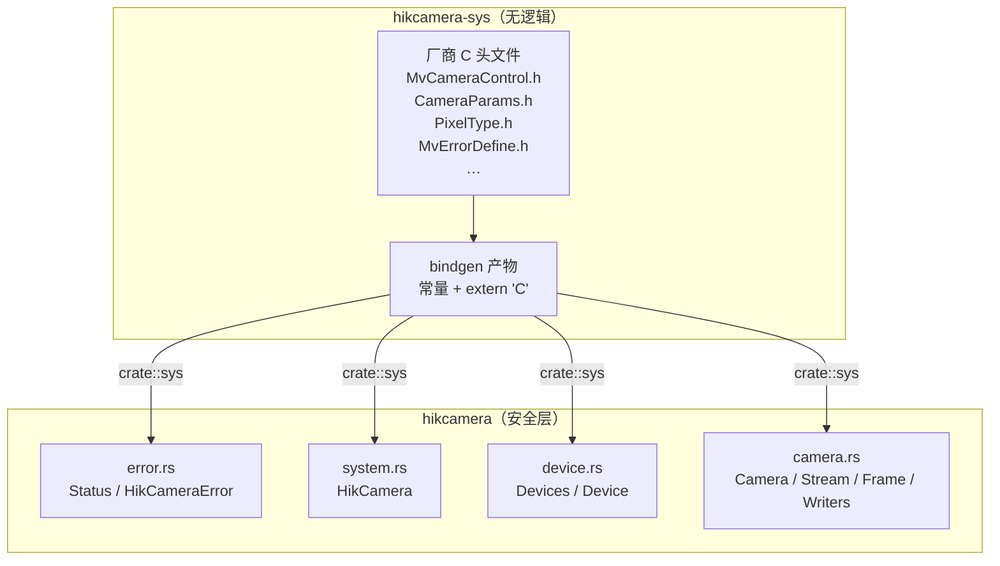

import { Card, CardGrid } from '@astrojs/starlight/components';
import LifecycleStrip from '@components/LifecycleStrip.jsx';

workspace 拆成两个职责很不一样的 crate。要改 wrapper，理解这个拆分——以及
`unsafe` 边界在哪里——是最重要的一件事。

## 两个 crate

<CardGrid>
  <Card title="hikcamera-sys" icon="seti:c">
    对厂商头文件跑 `bindgen` 的原始产物：常量、类型别名、结构体、
    `extern "C"` 函数签名。build script 同时链接 `MvCameraControl.lib`，
    把运行时 DLL 拷到最终二进制旁边。没有逻辑、没有封装、没有安全保证。
  </Card>
  <Card title="hikcamera" icon="seti:rust">
    高层安全 API。持有分层生命周期类型（`HikCamera` → `Device` →
    `Camera` → `Stream` → `Frame`）、错误模型、所有图像/视频 writer。所有
    对 `sys::*` 的 `unsafe` 调用都在这里。
  </Card>
</CardGrid>

## `unsafe` 边界

wrapper 关于 `unsafe` 只有一条规则：

> `crates/hikcamera/src/` 里不允许出现对 `crate::sys::*` 的 FFI 调用之外的
> `unsafe`，且这些调用应当已经被 `check(...)` 或更高层 helper 包好。

意思是每个 `unsafe { sys::MV_CC_*(...) }` 调用必然经过两个咽喉点之一：

1. **`error::check(code: i32) -> Result<()>`** —— 把 SDK 返回值转成
   `Result` 的唯一函数。状态码与 `MV_OK` 比较，其它都变成
   `HikCameraError::Sdk { status }`。
2. **`camera.rs` 里的更高层 helper** —— 例如"uninit buffer + check + 拷贝
   + 配对的 Free*"这种 per-FFI-call 模式。不变量非平凡的地方只有这些。

新增 `unsafe` 块必须配 `// SAFETY:` 注释解释不变量。

## 分层生命周期

<LifecycleStrip locale="zh" />

每一层都是一个独立类型，各持有 C SDK 生命周期的一段。层与层之间的所有权
转移是**唯一**的前进方式：

"按值消费"的箭头是故意的——它们让不可能的状态根本表达不出来：

- 同一个 `Camera` 上不可能有两个活动 `Stream`。
- `stop()` 之后不可能调 `take_frame`（`Stream` 已经没了）。
- `Camera` 还开着时不可能调 `MV_CC_Finalize`——`Camera<'hik>` 上的
  `'hik` 生命周期禁止了它。

## 模块地图

| 模块 | 职责 |
| --- | --- |
| `crates/hikcamera/src/lib.rs` | crate 根、公共 re-export |
| `error.rs` | `HikCameraError`、`Status` newtype、SDK 码查找表 |
| `system.rs` | `HikCamera`（SDK init/finalize 引用计数）、`HikVersion` |
| `device.rs` | `Device` / `Devices` / `DeviceInfo` / `Transport` |
| `camera.rs` | `Camera`、`Stream`、`Frame`、所有节点表访问器、图像/视频 writer |

`hikcamera-sys/src/lib.rs` 是一个薄模块，从 `OUT_DIR` 里 `include!()` 两份生成
文件（先 `status_codes.rs`，再 `bindings.rs`）。它没有自己的逻辑——至于为什么
输出要拆成两份，见[绑定生成](/zh/developer/bindings-generation/)。

## 为什么这么拆？

1. **`bindgen` 重构很慢。** 把 FFI 隔离在 `hikcamera-sys` 里，意味着
   `hikcamera` crate 可以在不碰 C 头文件的情况下被重新 check（只要
   bindings 没变）。
2. **安全故事更清楚。** 一个 crate 允许 `unsafe`，另一个禁止。审 PR 时
   知道焦点在哪。
3. **版本节奏灵活。** bindings 和安全 API 可以走不同的 semver 节奏。
   （现在共用 workspace 版本，但这个边界存在，将来需要就能用上。）

## 下一步

- 绑定是如何生成的（状态码 vs `bindgen` 输出） → [绑定生成](/zh/developer/bindings-generation/)。
- 错误如何被类型化 → [错误模型](/zh/developer/error-model/)。
- 如何贡献 → [贡献](/zh/developer/contributing/)。
