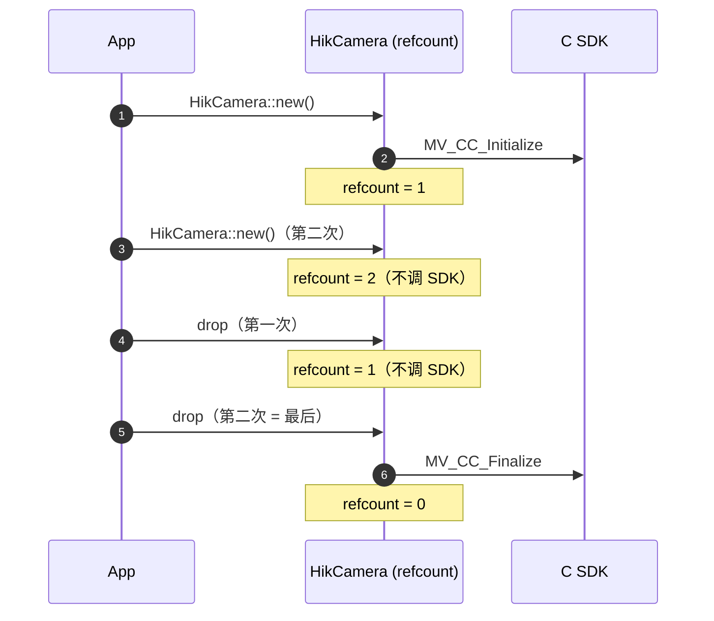

import { Aside, Steps } from '@astrojs/starlight/components';
import LifecycleStrip from '@components/LifecycleStrip.jsx';

`HikCamera` 是 wrapper 最外层的类型，持有**全局** SDK 状态——也就是 C 层
`MV_CC_Initialize` / `MV_CC_Finalize` 这一对调用，它们必须把所有其它 SDK 调用
夹在中间。wrapper 里的其它类型都以 `HikCamera` 的生命周期为借主。

## 分层类型

<LifecycleStrip locale="zh" />

每一层各持有 C SDK 生命周期的一段：

| 类型 | C SDK 调用 | 持有 |
| --- | --- | --- |
| `HikCamera` | `Initialize` / `Finalize` | 全局 SDK 初始化引用计数 |
| `Devices` / `Device` | `EnumDevices` / `IsDeviceAccessible` | 可见设备快照 |
| `Camera` | `CreateHandle` / `OpenDevice` / `DestroyHandle` | 设备句柄、参数节点表 |
| `Stream` | `StartGrabbing` / `StopGrabbing` | 采集会话、录像状态 |
| `Frame` | `GetImageBuffer` / `FreeImageBuffer` | 单帧图像 buffer |

## `HikCamera`

- **`HikCamera::new()`** —— 初始化 SDK。
  - 首个实例调用 `MV_CC_Initialize`。
  - 后续实例只是把共享引用计数 +1，**不**会再调一次 `Initialize`。
  - SDK 拒绝初始化时返回 `HikCameraError::Sdk { status }`。

- **`hik.version()`** —— 拿到类型化的 `HikVersion`（major / minor / patch /
  build）。底层是 `MV_CC_GetSDKVersion`。

- **`hik.devices()`** —— 枚举可见设备，返回 `Devices`，可遍历或筛选，详见
  [设备选择](/zh/guide/device-selection/)。底层是 `MV_CC_EnumDevices`。

- **`Drop`** —— 把共享引用计数 -1。**只有**进程里最后一个 `HikCamera` drop
  时才会真正调用 `MV_CC_Finalize`。

## 共享引用计数

引用计数是进程级的、用 mutex 保护的，可以多线程构造 `HikCamera`，或者放在
`OnceLock` / `LazyLock` 里贯穿整个程序。

## `HikVersion`

`HikVersion` 是个简单的 `Copy` 结构体，把 `MV_CC_GetSDKVersion` 返回的
`u32` 拆开：

| 字段 | 含义 |
| --- | --- |
| `major` | 主版本 |
| `minor` | 次版本 |
| `patch` | 补丁版本 |
| `build` | 构建版本 |
| `raw` | 原始 `u32`，用于诊断 |

`HikVersion::current()` 不需要先有 `HikCamera` 实例，适合在 `--version`
flag 里直接读。

## 生命周期顺序规则

<Steps>

1. `HikCamera` 必须比由它派生出的 `Device` / `Camera` / `Stream` / `Frame`
   活得长。wrapper 用 Rust 生命周期 `'hik` 强制保证。
2. `Devices` 是一次快照——它 drop 时底层 `MV_CC_DEVICE_INFO_LIST` 内存会被
   释放。选择设备期间要把它保留着。
3. `Camera::stream()` **按值消费** `Camera`。调 `stream.stop()` 把它拿回来。
4. `Stream::stop()` **按值消费** `Stream`。停止的流不能重启——重新
   `camera.stream()` 拿新的。
5. `Frame` 不借用 `Stream`，但它的 buffer 必须归还 SDK。用完（或拷出你需要的
   字节后）就 drop 掉。

</Steps>

<Aside type="note" title="为什么 stream() 和 stop() 按值消费 self">
  `MV_CC_StartGrabbing` 和 `MV_CC_StopGrabbing` 在同一句柄上不是幂等的，SDK
  也不追踪嵌套 grabbing。让 `stream()` 和 `stop()` 拿 `self`，类型系统会保证
  你不可能泄漏 grabbing 状态或重复 stop。
</Aside>

## 下一步

- 选中某一台相机 → [设备选择](/zh/guide/device-selection/)。
- 配置参数 → [相机配置](/zh/guide/camera-configuration/)。
