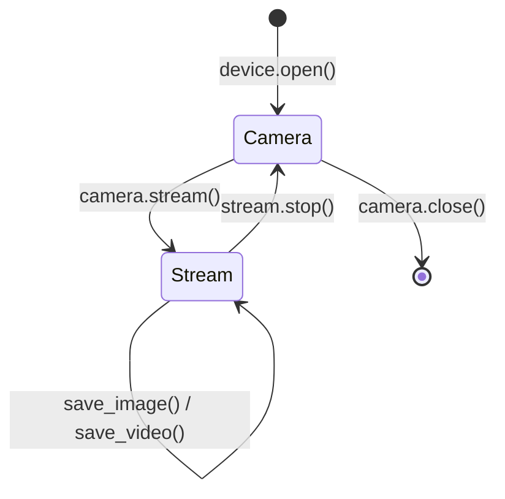

import { Aside } from '@astrojs/starlight/components';

`Camera::stream()` 按值消费 `Camera`，调用 `MV_CC_StartGrabbing`，返回
`Stream`。从 `Stream` 可以取帧、查 buffer 深度，最后用 `stop()` 拿回
`Camera`。

## 生命周期



这个状态机由**所有权**而非运行时 flag 强制：

- `stream()` 按值拿 `self`——不可能意外 double-grab。
- `stop()` 按值拿 `self`——不可能意外重启。
- `take_frame` 只存在于 `Stream`，`Camera` 上没有。

## 取一帧

```rust
use std::time::Duration;

let mut stream = camera.stream()?;
let frame = stream.take_frame(Duration::from_secs(1))?;
println!("{}x{}, {} bytes", frame.info.width, frame.info.height, frame.data.len());
```

`take_frame(timeout)` 的流程：

1. 调 `MV_CC_GetImageBuffer(handle, &mut out, timeout_ms)`。
2. SDK 返回 `MV_E_NODATA` 时 wrapper 透传为
   `HikCameraError::Sdk { status }`——通常就是"超时"。
3. 成功时把帧字节拷进 owned `Vec<u8>`，立刻调
   `MV_CC_FreeImageBuffer` 释放 SDK 槽位。
4. 返回 `Frame { info: FrameInfo, data: Vec<u8> }`，**不**借用
   `Stream`，可以任意持有。

## 帧信息

`FrameInfo`（来自 `MV_FRAME_OUT_INFO`）承载每一帧的元数据：

| 字段 | 含义 |
| --- | --- |
| `pixel_type` | 像素格式（`MvGvspPixelType` 值） |
| `width`, `height` | 图像尺寸 |
| `frame_len` | 数据 buffer 字节数 |
| `timestamp`, `frame_id` | 设备端时序 |
| `device_id`, `trigger_info` | 来源 / 触发元数据 |
| … | 加上传输层专属字段 |

`data: Vec<u8>` 长度始终等于 `frame_len`；遇到零长度的异常帧时
`take_frame` 会返回 `EmptyFrame` 错误，而不是给你一个空帧。

## Buffer 深度

SDK 内部维护帧 buffer 池。不取帧也能查里面有多少待取：

```rust
let pending: u32 = stream.get_image_count()?;
```

可以清空队列（长暂停或触发突发之后很有用）：

```rust
stream.clear_buffer()?;
```

## 帧变换

`Stream` 暴露了几个就地变换方法，走 SDK 自己的转换路径（所以它理解源像素
格式）：

```rust
use hikcamera::{ImageFormat, Rotation};

// 转成下游更好处理的像素格式。
let rgb = stream.convert_frame(&frame, ImageFormat::Rgb8.raw())?;

// 旋转 / 翻转——倒装相机常见。
let rotated = stream.rotate_frame(&frame, Rotation::Angle180)?;
let flipped = stream.flip_frame(&frame, Flip::Vertical)?;
```

返回的都是**新** `Frame`，原帧不动。

## 停止采集

```rust
let camera = stream.stop()?;
camera.close()?;
```

`stop()` 的流程：

1. 如果当前正在录像（`VideoWriter` 调过 `MV_CC_StartRecord`），先调
   `MV_CC_StopRecord`。
2. 调 `MV_CC_StopGrabbing`。
3. 把底层 `Camera` 的所有权交还给调用方。

<Aside type="note" title="Drop 是尽力而为">
  `Stream` 也实现了 `Drop` 作为兜底：如果没调 `stop()` 就出了作用域，
  `Drop` 会调 `MV_CC_StopGrabbing`（必要时也调 `MV_CC_StopRecord`），避免
  设备卡在 grabbing 状态。但能调 `stop()` 时还是要显式调，它能把 `Camera`
  还给你并透传 SDK 错误。
</Aside>

## 下一步

- 把帧保存出去 → [图像与视频写入](/zh/guide/image-and-video/)。
